# DJ 30 Trading BOT

(Picture from ActiveState.com)

### Contributors: 
 Femi Aina (https://github.com/Femi-tech), Phara Dorisca (https://github.com/pdorisca), Khulika Rojanakanoksak (https://github.com/Khulikaroj),Ogo Nwanyanwu (https://github.com/Ogo1024)

For this project, our goal was to build a robo-trading agent that executed trading decicions and tactical entries from a Machine Learning derived strategy. Our data collection and cleaning focused on 3 main data types (Fundamental, Technical, and Sentiment) to produce feature inputs we believe are relevant for stock investment. In each component, we pre-processed the data to produce buy/sell signals based on the represent indicators, utilzing the resultant outputs to train our ML model to generate trading decisions (Fundamental, Technical) and tactical entries (Sentiment). The robo-trading agent elevated our ability to trade all components of Dow Jones 30 Index efficiently, by eliminating emotion from determining strategy and implementing a faster decision making process. 

Components of the Dow Jones 30 Index are as follows: AXP, AMGN, AAPL, BA, CAT, CSCO, CVX, GS, HD, HON, IBM, INTC, JNJ, KO, JPM, MCD, MMM, MRK, MSFT, NKE, PG, TRV, UNH, CRM, VZ, V, WBA, WMT, DIS, DOW

Machine Learning method: Random Forest. 

## Jupyter Notebooks

1. ML.ipynb: Main notebook for training and testing Machine Learning.

2. Sentiment.ipynb: Building sentiment signals from News API by using NLP (Vader sentiment analyzer).

3. Trade.ipynb: Code for feeding into AWS EC2 which is connected to Alpaca trading platform. **Disclaimer: We haven't modify this code to take prediction from ML in order to determine timing to buy DJ30. 

## CSV files

1. fundamental_signal
2. technical_signal
3. sentiment_signal
4. company_list_DJ30

## Features for ML

We generated the signal data from 3 main components:
1. Fundamental: Return on Equity, Operating Margin, Debt-to-Equity ratio, and Pietroski F-score.
2. Technical: Relative Strength Index (RSI).
3. Sentiment: News relevant to company name

Sources of these data are Yahoo Finance, News API, SimFin.

However, we can pull News API by just 1 month. With this limitation, we build two different set of data...

x_var_list_long = ["ROE_Sig", "OpMargin_Sig","DebtEq_Sig","Fscore_Sig","RSI"]

x_var_list_short = ["ROE_Sig", "OpMargin_Sig","DebtEq_Sig","Fscore_Sig","RSI","Sentiment"]

Long-Horizon Model: the features used in this ML model are just Fundamental and Technical. We set horizon for 1 year in this model.

Short-Horizon Model:  all 3 main features will be included in the ML model. We set horizon for 30 days in this model.

## Functions

1. build_input_long( ): building dataframe for longer-horizon ML.

2. build_input_short( ): building dataframe for longer-horizon ML.

3. X_train_long( ), X_test_long( ): split training and teseting features for x_var_list_long, Long-Horizon ML.

4. y_train_long( ), y_train_long( ): split y for using in Longer-Horizon ML.

5. X_train_short( ), X_test_short( ): split training and teseting features for x_var_list_short , Short-Horizon ML.

6. y_train_short( ), y_train_short( ): split y for  Short-Horizon ML.

7. random_forest( ): training, fitting, predicting positive-return trade signal by Random Forest Model. The function will return prediction dataframe and classification report.

## Conclusions

* In using Fundamental and Technical signals in predicting days with positive return of particular stock, the ML perform well for most of stocks in DJ30. However, the model is unlikely fit for predicting timing to buy AMGN when adding Sentiment signal.

* Adding Sentiment signals increase prediction power for most stocks in DJ30 list, higher accuracy score, higher precision score, and higher recall score. However, this better prediction power could arrive from using more recent features than Long-Horizon model. However, contrast evidence is seen in prediction for AAPL, AMGN, JPM.

* Using ML to predict timing to enter/exit stock trading strategy should be done with caution. Further works needed for improving this project could be (1) using RNN model which fit better for time-series data (2) better pre-processing of fundamental data to account for sector normilzation, potentially accounting for variability between stocks from different sectors (APPL/MSFT vs AMGN/JNJ) and/or (3) expanding sentiment signal data by web scrapping news or paid-account for News API. 

## Example of prediction and model evaluation

ML result on AAPL

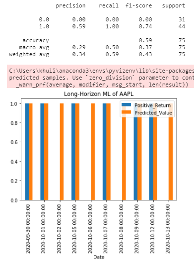

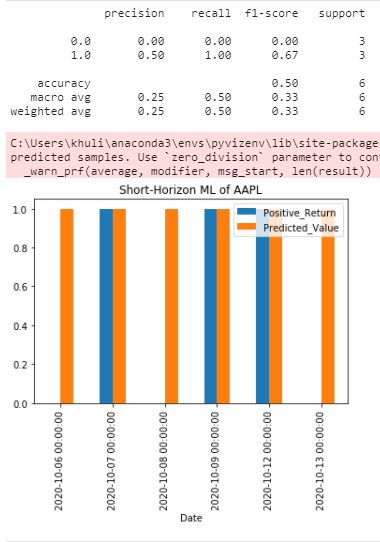

ML result on MSFT

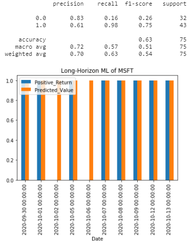

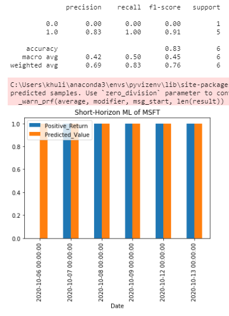

ML result on AMGN

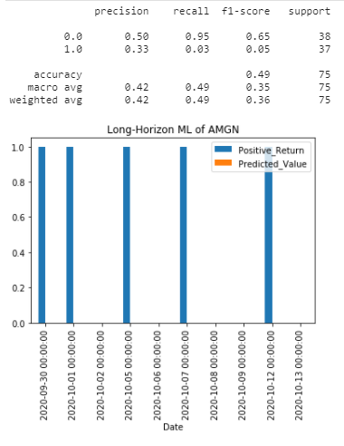

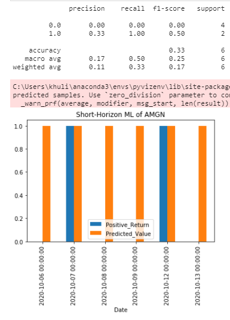

ML result on JNJ

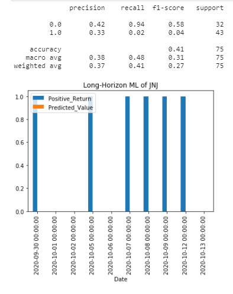

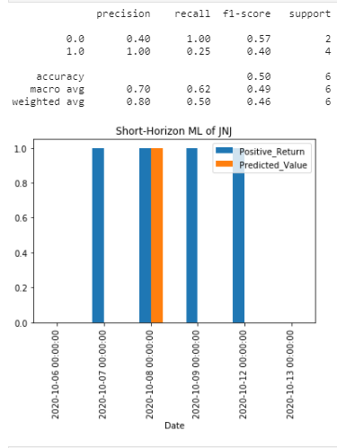

ML result on JPM

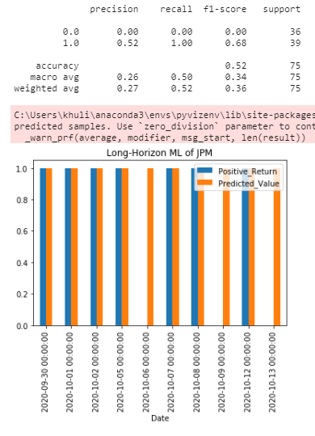

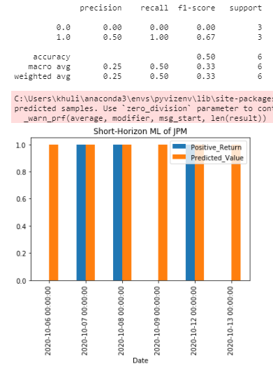

## BOT

We create algorithm trading by EC2 (AWS) and link to Alpaca paper trade account. In this part, trading decision is based on technicla signal only.

Algo cide connecting to EC2 AWS.

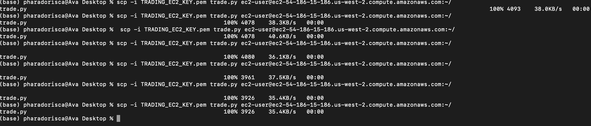

Code testint in terminal

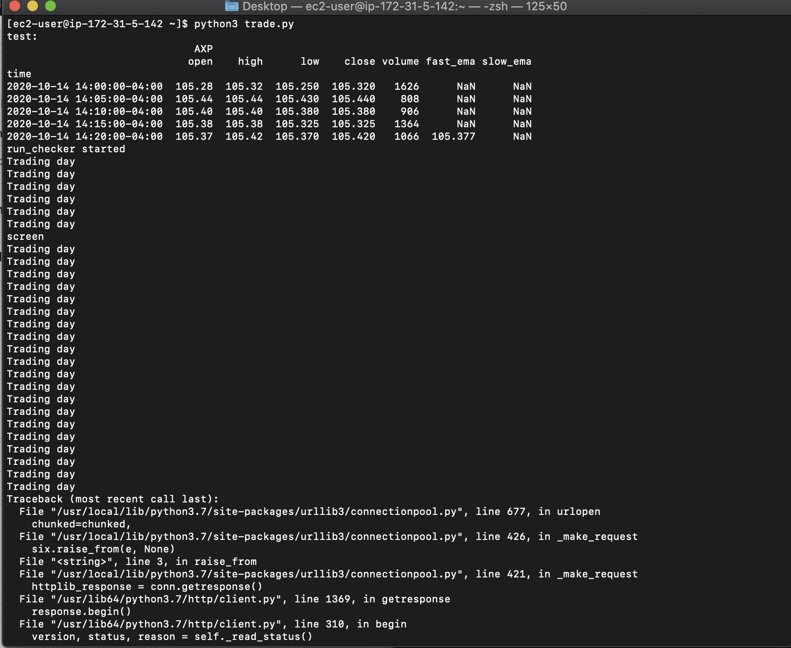

Alpaca paper trade account.

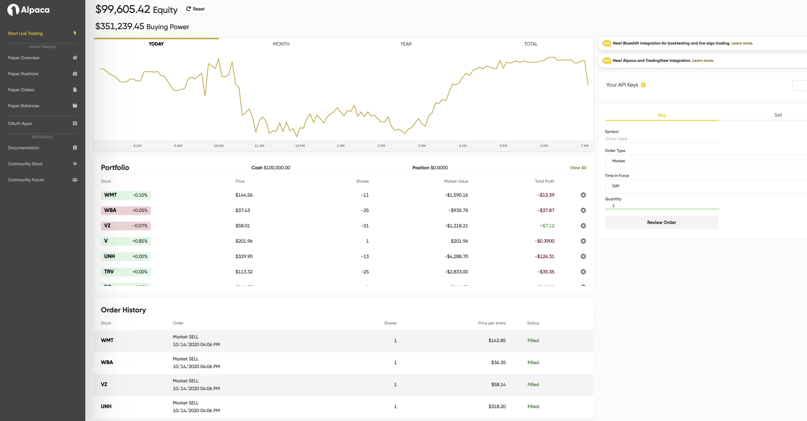

